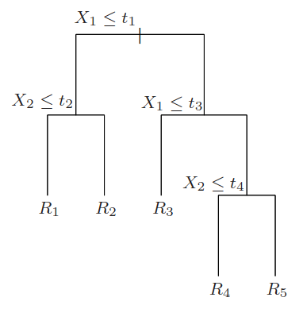
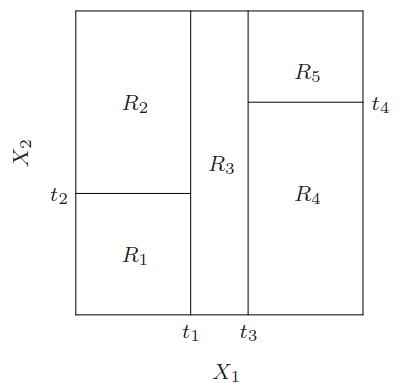

This analysis makes use of decision trees. An often used umbrella term to include other tree-based methods, like regression trees, decision trees are interesting in that they can be used as human-readable flowcharts as well as components of robust machine learning models. In this analysis, I am using decision trees for classification purposes, and so when I refer to decision trees I am referring to them in that capacity.

Given a set of variables, decision trees are formed recursively using yes-no decisions with respect to one variable at a time. The phase space made up of these variables is systematically partitioned by such a tree into regions called *leaf* nodes. Consider, for example, independent variables $X_1$ and $X_2$. @fig-dtexample shows a decision tree that divides the space spanned by $X_1$ and $X_2$ into the regions $R_1$, $R_2$, $R_3$, $R_4$, and $R_5$.

::: {#fig-dtexample layout-ncol=2}

{#fig-decisiontree width=90%}

{#fig-partitionedspace width=90%}

A decision tree and the partitioned space it produces.
:::